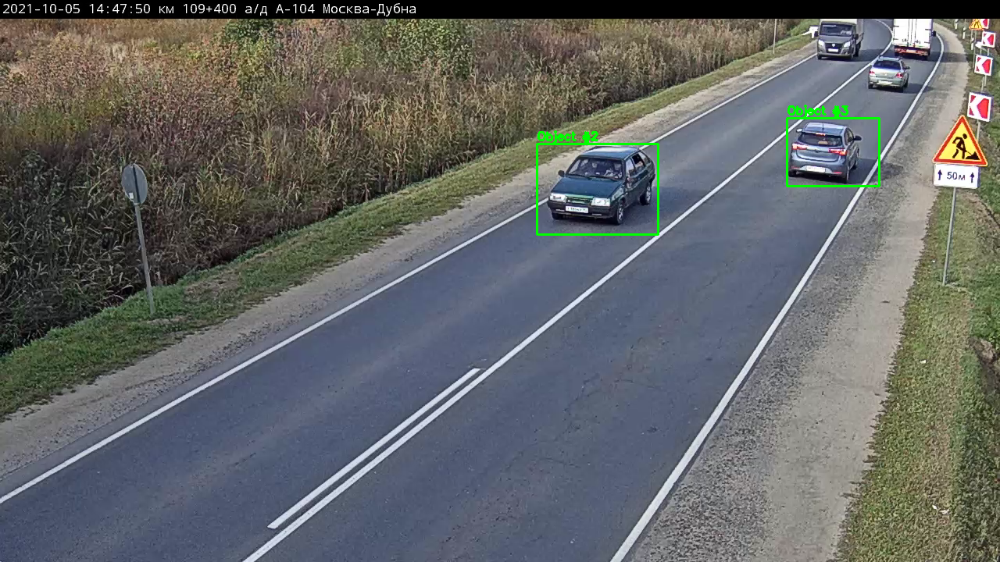
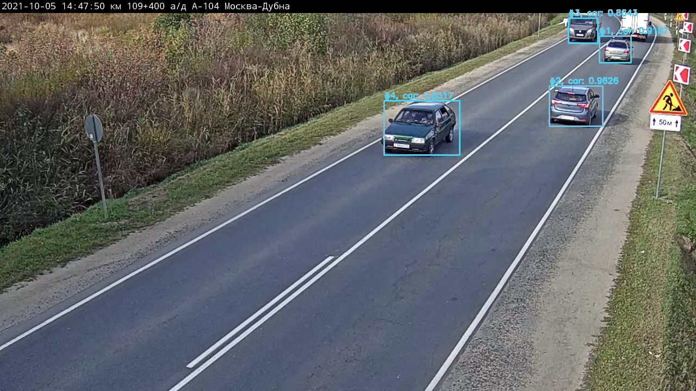

# Test task for Invian

This repository contains solutions for tracking moving objects. One solution uses _OpenCV_ methods to find differenece between frames and detect contours. Another solutions uses pretrained _YOLO_ model that also can identify the class of detected object.

## How to run:

1. Clone repository
2. Download _YOLO_ model (only for second solution) from [here](https://www.dropbox.com/s/1ke9p0wxdxtv29q/yolo-coco-model.zip), and unzip archive in project folder
3. Install requirements: 
```txt
pip install -r .\requirements.txt
```
4. Run code using terminal:
```
python opencv_impl.py
```
or
```
python yolo_impl.py
```
If you want to run the code for your own video, add `--video "path/to/video.mkv"` in the end of a line

## Results
- Detection result using OpenCV library:

- Detection result unsing YOLO:
